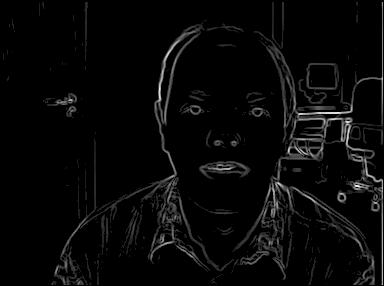
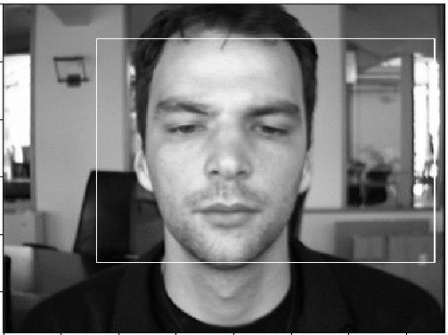

# Face Detection

### Authors

- Gabriel Mattheus Bezerra Alves de Carvalho (@GabrielBCarvalho)
- Wallace Cruz de Souza (@Cruwal)

## Abstract

This project intends to identify human faces in images using techniques of image processing, such as image segmentation and image enhancement. The project application is computational photography, applying the results in autofocus in cameras.
Thus, given an image containing one or more faces of people, the same image is returned with squares delimiting the faces contained in it.

## Description

This project focuses on a solution to the face detection problem with a system based on edges. The main steps are presented below, and are mainly inspired by the work of S. Anila and N. Devarajan (2010). In addition, the dataset used for neural network training is currently "The MUCT Face Database", available at https://github.com/StephenMilborrow/muct

### Steps

1\: Remove noise using median filter;

2\: Contrast adjustment using histogram equalization;

3\: Construct the edge image applying Sobel operator;

4\: Segment image into blocks;

5\: Evaluate features of the blocks;

6\: Use features values into a Backpropagation Neural Network (BPN) to classify the block as face or non-face;

7\: Display the image with squares delimiting the faces.

### Input example

The input is represented by an image containing one or more faces. The image can be either grayscale or colored. 
The following is an example of an input image.

### Output example (objective)

The following is an example of the desired output image, based on the previous input image.

# Steps

At the end of sobel operator the image obtained is as follow. An black white image with higher
contrast so edges can be easily identified.

After an integral image is generated and is used together with Haar Features for identify the
main characteristics of a potential face. This characteristics are send to a back Multilayer Perceptron to get the final result.

# Results

At the end of the project several difficulties were encountered. Initially the processing time was very long due to the various background elements of the image, which could not be eliminated with the use of the threshold after the application of the sobel operator. The use of the algorithm in an application is impracticable. This difficulty was overcome with the use of the integral image, which made possible a great optimization in the time of exeuction. Another great difficulty lies in the generation of a quality dataset, where a great effort was applied and yet the result was not satisfactory. As you can see in the following pictures, there is a lot of chances for improvement in the project. In some images the box was a little bigger than the ideal.

## References

S. Anila and N. Devarajan. (2010). Simple and Fast Face Detection System Based on Edges. International Journey of Universal Computer Sciences (Vol.1-2010/Iss.2), pp. 54-58.

Traditional Face Detection With Python: https://realpython.com/traditional-face-detection-python/

The MUCT Face Database: https://github.com/StephenMilborrow/muct
